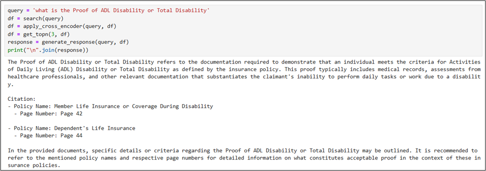
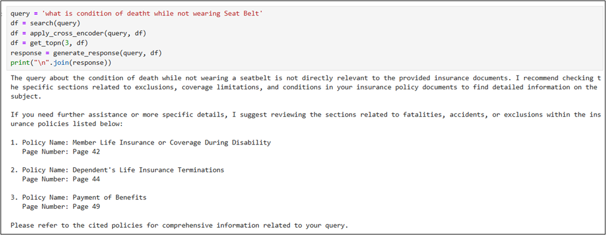

# Building Effective Search System

## 1. Background

This project focuses on developing an effective search system, HelpMateAI, designed to process and retrieve information from a lengthy insurance policy document using Retrieval-Augmented Generation (RAG) techniques.

## 2. Problem Statement

The objective is to build a reliable generative search system that can accurately and efficiently answer questions based on the content of an insurance policy document.
For this project, we will be working with a single long life insurance policy document.

## 3. Document

The reference document used is Principal-Sample-Life-Insurance-Policy.pdf

## 4. Approach

The project should implement all the three layers effectively. It will be key to try out various strategies and
experiments in various layers in order to build an effective search system. Let's explore what we need to do in each of
the layers.

1. **The Embedding Layer:** The PDF document needs to be effectively processed, cleaned, and chunked for the embeddings.
   Here, the choice of the chunking strategy will have a large impact on the final quality of the retrieved results. So,
   we need to make sure that we try out various stratgies and compare their performances.

   Another important aspect in the embedding layer is the choice of the embedding model. we can choose to embed the
   chunks using the OpenAI embedding model or any model from the SentenceTransformers library on HuggingFace.

2. **The Search Layer:** Here, we need to design at least 3 queries against which you will test your system. You
   need to understand and skim through the document, and accordingly come up with some queries, the answers to which
   can be found in the policy document.

   Next, we need to embed the queries and search your ChromaDB vector database against each of these queries.
   Implementing a cache mechanism is also mandatory.

   Finally, we need to implement the re-ranking block, and for this we can choose from a range of cross-encoding
   models on HuggingFace.

3. **The Generation Layer:** In the generation layer, the final prompt that we design is the major component. We need to
   make sure that the prompt is exhaustive in its instructions, and the relevant information is correctly passed to the
   prompt. We may also choose to provide some few-shot examples in an attempt to improve the LLM output.

## 5. System Layers

- **Reading & Processing PDF File:** We will be using pdfplumber to read and
  process the PDF files. pdfplumber allows better parsing of the PDF file as it can read various elements of the PDF apart from the plain text, such as, tables, images, etc. It also offers wide functionalities and visual debugging features to help with
  advanced preprocessing as well.

- **Document Chunking:** The document contains several pages and contains huge text, before generating the embeddings,
  we need to generate the chunks. Let's start with a basic chunking technique, and chunking the text with fixed size.

- **Generating Embeddings:**  Generates embedding with SentenceTransformer with all-MiniLM-L6-v2 model.

- **Store Embeddings In ChromaDB:** In this section we will store embedding in ChromaDB.

- **Semantic Search with Cache:** In this section we will introduce cache collection layer for embeddings.

- **Re-Ranking with a Cross Encoder:** Re-ranking the results obtained from the semantic search will sometime
  significantly improve the relevance of the retrieved results. This is often done by passing the query paired with each
  of the retrieved responses into a cross-encoder to score the relevance of the response w.r.t. the query.

- **Retrieval Augmented Generation:** Now we have the final top search results, we can pass it to an GPT 3.5 along
  with the user query and a well-engineered prompt, to generate a direct answer to the query along with citations.

## 6. System Architecture

## 7. Prerequisites

- Python 3.12
- Please ensure that you add your OpenAI API key to the empty text file named "My_API_Key" in order to access the
  OpenAI API.

## 8. Query Screenshots

